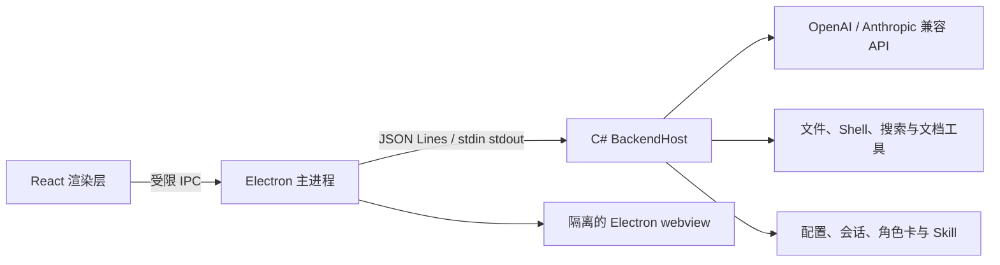

# RanParty

RanParty 是一个面向 Windows 的本地 AI Agent 桌面客户端。它把多模型会话、角色卡、工作区文件、工具调用、子 Agent、上下文压缩、图片输入和 SkillHub 技能管理整合到一个 Electron 应用中，同时由本地 C# 后端负责模型协议、数据持久化和安全校验。

> 当前桌面版：`1.7.0`。正式运行链路为 Electron + React + C#，仓库中旧 WinForms 代码仅作为历史实现保留。

## 主要能力

- **多模型配置**：支持 OpenAI Chat Completions、OpenAI Responses 和 Anthropic Messages 兼容接口。
- **模型能力声明**：可配置工具调用、图片输入、思考模式、上下文窗口和最大输出 Token，并可从兼容接口读取模型列表、测试连接。
- **工作区会话**：会话关联独立工作目录，支持重命名、切换模型/工作区、时间戳和右键操作。
- **Agent 工具循环**：AI 可读取和修改授权目录中的文件、运行 Shell/PowerShell、联网搜索，并将调用过程折叠成任务步骤。
- **子 Agent 协作**：主 Agent 可选择其他模型配置处理边界清晰的子任务，并把协作记录和结论合并到当前会话。
- **上下文管理**：显示当前 Token 占用，支持手动总结；达到阈值时自动压缩，并在对话中记录压缩事件。
- **角色卡**：`SOUL.md` 或自定义角色卡作为互斥的默认会话角色上下文，可结构化编辑或直接编辑 Markdown。
- **图片与 Skill**：支持粘贴、拖入和多选图片；Skill 采用显式选择、仅下一次发送生效的注入方式。
- **SkillHub 技能广场**：在主页统一搜索、安装、查看和卸载技能。安装阶段只提取 `SKILL.md`，不会静默执行脚本。
- **内置浏览器与文件预览**：右侧栏可浏览网页、工作区文件和任务产物，并支持系统默认程序或外部浏览器打开。
- **便携数据目录**：打包版把可编辑数据放在程序旁的 `RanPartyData/`，避免持续占用系统盘用户目录。

## 界面结构

```text
左侧栏                         主会话区                         右侧栏
├─ 新建任务                    ├─ 标题与会话菜单                ├─ 任务产物
├─ Skill 广场                  ├─ 消息、推理与工具步骤          ├─ 工作区文件
├─ 工作区与会话                └─ 输入框、模型、审批、工作区    ├─ 文件预览
└─ 设置                                                        ├─ 内置浏览器
                                                                └─ 侧边对话
```

## 架构



关键目录：

| 路径 | 职责 |
| --- | --- |
| `electron/src/` | React 客户端、会话 UI、设置、右侧栏和 Skill 广场 |
| `electron/main.ts` | 桌面窗口、系统对话框、文件操作、内置浏览器安全边界和后端进程管理 |
| `backend/BackendHost.cs` | IPC、会话、模型配置、工具循环、上下文压缩、子 Agent 与 SkillHub |
| `Core/` | 模型 API 协议、配置和会话持久化 |
| `Cats/`、`Tools/` | 工作区工具以及 Excel、Word、Markdown 支持 |
| `Config/`、`RanParty/` | 首次启动使用的配置、角色、规则和技能种子数据 |
| `plugins/` | RanParty 插件和标准 `SKILL.md` 示例 |
| `tests/` | 协议、上下文、工具循环、子 Agent、搜索和技能市场冒烟测试 |
| `docs/` | 客户端架构和 Codex/Skill 市场调研 |

更细的运行文件和遗留代码说明见 [客户端架构](docs/client-architecture.md)。

## 模型配置

设置页可以维护多个模型配置，每个配置包含：

- 提供商：OpenAI 兼容或 Anthropic 兼容；
- OpenAI 线路：Chat Completions 或 Responses；
- API 地址、API Key、模型名称和角色卡；
- 工具调用、图片输入、思考模式；
- 上下文窗口与最大输出 Token，单位均为 **Token**。

常见上下文模板为 `32K / 64K / 128K / 256K`，输出模板为 `8K / 16K / 32K / 64K`。实际值必须以模型服务商限制为准；配置过大不会让模型突破服务端上限。API Key 留空保存时会保留旧值，渲染层只能看到“已配置”状态，不能读取明文密钥。

## Skill 与 SkillHub

RanParty 支持以下来源：

1. 当前工作区到仓库根目录中的 `.agents/skills/<skill>/SKILL.md`；
2. 用户目录中的 `%USERPROFILE%\.agents\skills`；
3. 兼容目录 `RanParty/L2/Skill/*.md`；
4. 通过 SkillHub 技能广场安装到 `RanParty/InstalledSkills/` 的技能。

Skill 的调用方式遵循“先展示元数据，再按需读取正文”：

1. 在输入框的 Skill 选择器中显式选择一个或多个技能；
2. 前端只提交由后端签发的 Skill ID，不能提交任意文件路径；
3. 后端重新校验 ID 和允许的根目录，再读取完整 `SKILL.md`；
4. 内容仅注入下一次发送，请求被接收后自动清空选择；
5. 首版不会自动运行 Skill 附带的脚本、Hook 或 MCP。

技能广场使用与 [SkillHub CLI 安装说明](https://skillhub.cn/install/skillhub.md)一致的官方目录、搜索和下载源。市场内容属于第三方数据，应在安装和使用前检查说明、权限与 API Key 要求。

## 开发环境

- Windows 10/11 x64
- Node.js 20 或更高版本
- .NET 8 SDK
- npm

### 1. 安装前端依赖

```powershell
cd electron
npm install
```

### 2. 发布 C# 后端

打包配置读取 `backend-publish-v4/`，必须生成 Windows x64 自包含后端：

```powershell
dotnet restore ..\backend\RanParty.Backend.csproj -r win-x64
dotnet publish ..\backend\RanParty.Backend.csproj `
  -c Release `
  -r win-x64 `
  --self-contained true `
  -p:PublishSingleFile=false `
  -o ..\backend-publish-v4 `
  --no-restore
```

### 3. 启动开发版

```powershell
cd electron
npm run dev
```

只启动 Vite 时，`electron/src/mockBridge.ts` 会提供界面模拟数据；完整工具和配置能力必须由 Electron 启动本地 C# 后端后才能使用。

## 检查与测试

```powershell
cd electron
npm run typecheck
npm run build

cd ..
dotnet build backend\RanParty.Backend.csproj -c Release
node tests\provider-protocol-smoke.mjs
node tests\context-auto-compaction-smoke.mjs
node tests\tool-loop-guard-smoke.mjs
node tests\subagent-delegation-smoke.mjs
node tests\skill-marketplace-smoke.mjs
node tests\web-search-live-smoke.mjs
```

联网搜索与 SkillHub 测试依赖当前网络环境和第三方服务可用性。

## 打包

完成自包含后端发布后执行：

```powershell
cd electron
npm run package
```

输出：

- 便携版：`electron/release-v7/RanParty-Electron-1.7.0.exe`
- 解包测试版：`electron/release-v7/win-unpacked/RanParty.exe`

打包后的程序不要求目标机器预装 .NET。首次启动会在程序同级创建 `RanPartyData/`；移动便携版时建议连同该目录一起移动。

## 数据与隐私

- 开发版直接使用仓库中的 `Config/` 和 `RanParty/`。
- 便携版使用程序旁的 `RanPartyData/`，其中保存模型配置、角色卡、会话和已安装 Skill。
- 工作区文件仅在选择的工作区和额外授权目录内访问。
- Shell/PowerShell 是否执行由审批模式控制；高风险操作仍应由用户确认。
- 内置浏览器启用上下文隔离、沙箱和独立持久分区，禁止网页启用 Node.js；新窗口请求交给系统浏览器处理。
- 第三方模型服务会收到用户选择发送的消息、图片、角色上下文和 Skill 内容，请按其隐私政策使用。

## 常见问题

### 模型调用返回 401/403

检查 API Key、接口地址、模型名称和协议是否匹配。`403` 也可能来自服务商的 IP 白名单或地区限制；这类限制无法由客户端绕过。

### 工具调用不断重复

后端会按“工具名 + 参数”识别重复调用，并设置本轮调用预算；达到上限后要求模型基于已有结果完成答复。仍频繁重复时，应检查模型是否真正支持结构化工具调用。

### 内置浏览器页面无法打开

内置浏览器只允许 `http://` 和 `https://`。某些网站会阻止嵌入、要求登录或触发验证，可使用工具栏“外部打开”交给系统浏览器。

### C 盘空间不足

使用便携版并放在其他磁盘即可。业务数据位于可执行文件旁的 `RanPartyData/`；构建依赖和发布目录也可以保留在项目所在磁盘。

## 相关文档

- [客户端架构与遗留代码](docs/client-architecture.md)
- [Codex Skill 市场接入调研](docs/codex-skill-marketplace-research.md)
- [Electron 开发说明](electron/README.md)
