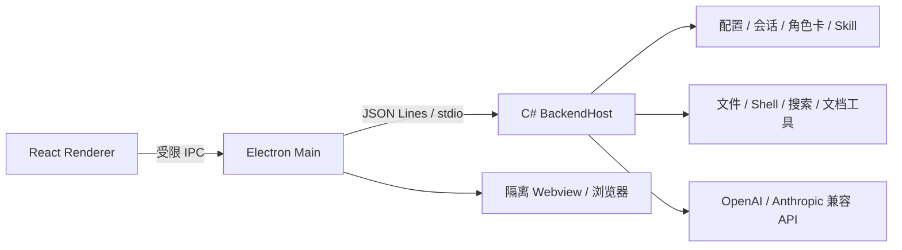

# RanParty

RanParty 是一个面向 Windows 的本地 AI Agent 桌面客户端。它把多模型对话、角色卡、工作区文件、工具调用、子 Agent、上下文压缩、图片输入、内置浏览器和 Skill 市场整合到同一个 Electron 应用中，并由本地 C# 后端负责模型协议、数据持久化和安全校验。

当前桌面版：`1.7.0`。主运行链路为 **Electron + React + C# BackendHost**。

## 核心能力

- 多模型配置：支持 OpenAI Chat Completions、OpenAI Responses 和 Anthropic Messages 兼容接口。
- 模型能力声明：可配置工具调用、图片输入、思考模式、上下文窗口和最大输出 Token，并支持从兼容接口拉取模型列表和测试调用。
- 角色卡：每个模型配置绑定一个角色卡；角色卡作为会话默认上下文注入，不与 `SOUL.md` 叠加注入。
- 工作区会话：会话可绑定工作目录，支持无工作区新建、后续切换、重命名、删除、时间戳和右键菜单。
- 工具调用：AI 可在授权范围内读取/修改文件、运行 Shell/PowerShell、联网搜索、抓取网页，并把调用过程折叠成任务步骤。
- 子 Agent：主 Agent 可调用其他模型配置处理边界清晰的子任务，并在结果中展示协作记录。
- 上下文管理：显示当前 Token 消耗，支持手动总结；达到阈值时自动压缩并在聊天中记录。
- 图片输入：支持粘贴、拖入和多选图片，最多 8 张，每张不超过 10MB。
- Skill 注入：Skill 采用显式选择、仅下一次发送生效；前端只提交后端签发的 Skill ID，不能传任意文件路径。
- Skill 广场：集成 SkillHub CLI/市场数据，用于搜索、安装、管理技能、专家套件和连接器。
- 右侧栏：支持任务产物、工作区文件、文件预览、内置浏览器和侧边页签。
- 便携数据：打包版把可编辑数据放在程序旁的 `RanPartyData/`，减少系统盘占用。

## 界面结构

```text
左侧栏                         主会话区                         右侧栏
├─ 新建任务                    ├─ 会话标题与菜单                ├─ 产物
├─ Skill 广场                  ├─ 消息、推理与工具步骤          ├─ 工作区文件
├─ 工作区与会话                └─ 输入框、模型、权限、Skill     ├─ 文件预览
└─ 设置                                                        ├─ 浏览器
                                                                └─ 侧边对话
```

## 架构



| 路径 | 说明 |
| --- | --- |
| `electron/src/` | React 客户端、聊天界面、设置页、右侧栏、Skill 广场 |
| `electron/main.ts` | Electron 主进程、窗口、系统对话框、文件操作、后端进程管理 |
| `backend/BackendHost.cs` | IPC、会话、模型协议、工具循环、上下文压缩、SkillHub 接入 |
| `Core/` | API 客户端、配置、安全策略、会话持久化、日志 |
| `Cats/` | 文件、Shell、联网搜索等工具实现 |
| `Tools/` | Excel、Word、Markdown 等办公文档工具 |
| `Config/` | 首次启动使用的默认配置种子 |
| `RanParty/` | 默认角色、规则、知识框架和内置技能种子 |
| `plugins/` | 插件与标准 `SKILL.md` 示例 |
| `tests/` | 协议、模型列表、上下文、工具循环、Skill 市场等冒烟测试 |
| `docs/` | 架构梳理、Skill 市场调研和实现记录 |

## 工具调用与安全边界

RanParty 的工具循环参考 Codex 的「模型规划 → 工具调用 → 结果回灌 → 继续推理」模式，但执行权在本地 C# 后端。

```text
模型返回 tool_calls
  ↓ 校验工具名、参数、重复调用和类别预算
  ↓ 对只读工具并行执行，对写入/Shell 串行执行
  ↓ 结果写入会话并发送前端事件
  ↓ 模型基于工具结果继续生成
```

主要安全策略：

- 文件访问只允许工作区和白名单目录，并拒绝 Junction/Symlink 绕过。
- Shell/PowerShell 受审批模式控制，高危命令会被拦截。
- 工具调用有递归深度、总调用次数、重复签名和类别预算限制。
- 网络工具阻止访问本地、内网和危险地址段。
- `open_path` 禁止直接打开 `.exe`、`.bat`、`.ps1` 等可执行文件。
- API Key 使用 Windows DPAPI 加密，渲染层只能看到“已配置”状态。

## 模型配置

设置页可以维护多个模型配置：

- 配置名称；
- OpenAI 兼容 / Anthropic 兼容；
- Chat Completions / Responses / Anthropic Messages；
- API 地址、API Key、模型名称；
- 角色卡；
- 是否支持工具调用、图片输入、思考模式；
- 上下文窗口和最大输出 Token。

上下文和输出单位均为 **Token**。常见上下文模板：`32K / 64K / 128K / 256K / 1M`；常见输出模板：`4K / 8K / 16K / 32K / 64K`。实际可用上限由模型服务商决定，客户端配置不会突破服务端限制。

## Skill 与 SkillHub

RanParty 支持四类 Skill 来源：

1. 当前工作区到仓库根路径中的 `.agents/skills/<skill>/SKILL.md`；
2. 用户目录 `%USERPROFILE%\.agents\skills`；
3. 兼容旧目录 `RanParty/L2/Skill/*.md`；
4. SkillHub 安装目录和 RanParty 技能广场下载的技能。

注入流程：

1. 前端先展示 Skill 元数据；
2. 用户在输入框或 Skill 广场显式选择；
3. 前端提交后端签发的 Skill ID；
4. 后端校验 ID、路径和允许根目录；
5. 仅读取 `SKILL.md` 注入下一次发送；
6. 请求接收后自动清空选择。

首版不会自动执行 Skill 附带脚本、Hook 或 MCP 服务。连接器和专家套件会作为市场对象展示，是否启用取决于后端能力和用户配置。

## 开发环境

要求：

- Windows 10/11 x64
- Node.js 20+
- .NET 8 SDK
- npm

安装前端依赖：

```powershell
cd electron
npm install
```

发布 C# 后端：

```powershell
dotnet restore ..\backend\RanParty.Backend.csproj -r win-x64
dotnet publish ..\backend\RanParty.Backend.csproj `
  -c Release `
  -r win-x64 `
  --self-contained true `
  -p:PublishSingleFile=false `
  -o ..\backend-publish-v4 `
  --no-restore
```

启动开发版：

```powershell
cd electron
npm run dev
```

只启动 Vite 时会使用 `electron/src/mockBridge.ts` 的模拟数据；完整工具调用必须通过 Electron 启动本地 C# 后端。

## 验证

```powershell
cd electron
npm run typecheck
npm run build

cd ..
dotnet build backend\RanParty.Backend.csproj -c Release
node tests\provider-protocol-smoke.mjs
node tests\provider-model-list-smoke.mjs
node tests\context-auto-compaction-smoke.mjs
node tests\tool-loop-guard-smoke.mjs
node tests\subagent-delegation-smoke.mjs
node tests\skill-marketplace-smoke.mjs
```

联网搜索和 SkillHub 测试依赖当前网络环境和第三方服务可用性。

## 打包

```powershell
cd electron
npm run package
```

输出：

- 便携版：`electron/release-v7/RanParty-Electron-1.7.0.exe`
- 解包版：`electron/release-v7/win-unpacked/RanParty.exe`

打包版不要求目标机器预装 .NET。首次启动会在程序同级创建 `RanPartyData/`，移动程序时建议连同该目录一起移动。

## 数据与隐私

- 开发版直接使用仓库中的 `Config/` 和 `RanParty/`。
- 便携版使用程序旁的 `RanPartyData/`。
- API Key 经 Windows DPAPI 加密存储。
- 工作区文件只在授权目录内访问。
- Shell/PowerShell 由审批模式和安全策略共同限制。
- 内置浏览器启用隔离和沙箱，不允许网页启用 Node.js。
- 第三方模型服务会收到用户发送的消息、图片、角色上下文和显式选择的 Skill 内容。

## 常见问题

### 模型调用返回 401/403

检查 API Key、接口地址、模型名称和协议是否匹配。`403` 常见原因是服务商 IP 白名单或地区限制，客户端无法绕过。

### AI 一直工具调用

后端会按规范化签名识别重复工具调用，并设置总调用次数、同类预算和递归深度上限。达到限制后会把拦截结果写回会话，要求模型基于已有信息完成回答。

### 内置浏览器空白

内置浏览器只适合常规 `http/https` 页面。部分网站会阻止嵌入、要求登录或触发验证，可使用“外部打开”交给系统浏览器。

### C 盘空间不足

建议使用便携版并放在其他磁盘。业务数据位于可执行文件旁的 `RanPartyData/`，不会固定写入 C 盘用户目录。

## 相关文档

- [客户端架构与遗留代码](docs/client-architecture.md)
- [Codex Skill 市场接入调研](docs/codex-skill-marketplace-research.md)
- [Electron 开发说明](electron/README.md)
