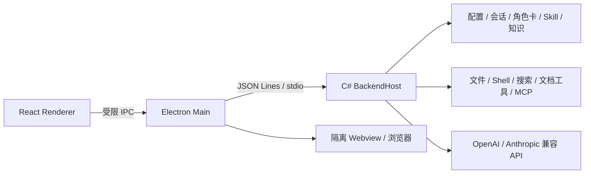

# RanParty

RanParty 是一个面向 Windows 桌面的本地 AI Agent 客户端。它把多模型对话、角色卡、工作区文件、工具调用、子 Agent、图片理解、Skill 广场、知识管理、上下文压缩、会话引用和右侧产物预览整合在一个 Electron 应用中，并由本地 C# 后端负责模型协议、数据持久化、工具安全边界和系统资源访问。

当前桌面版版本：`1.7.0`  
主运行链路：`Electron + React + C# BackendHost`

## 功能概览

- 多模型配置：支持 OpenAI 兼容 Chat Completions、OpenAI Responses 与 Anthropic Messages。
- 模型能力声明：可配置工具调用、图片输入、思考模式、上下文窗口、最大输出 Token，并支持连接测试和模型列表获取。
- 角色卡：模型配置绑定一个角色卡；角色卡作为会话默认上下文注入，避免多张角色卡叠加造成语义混乱。
- 工作区会话：支持无工作区新建、工作区内新建、切换工作区、重命名、删除、右键菜单和最后消息时间。
- 会话引用：可复制 `@session:<id>` 引用，在另一个会话中注入历史会话的交接摘要、最近摘录和相关产物路径。
- 对话模式：
  - Default：可在审批约束下使用工具完成任务。
  - Plan：只输出计划，不调用工具、不写文件；计划完成后由用户选择同意执行、修改计划或取消。
  - Ask：只回答问题，不调用工具、不写文件、不委派子 Agent。
  - Goal：保存会话内持久目标状态，后续围绕目标持续推进。
- 工具调用：模型可在授权范围内读写工作区文件、运行 Shell/PowerShell、联网搜索、抓取网页，并把过程合并为任务步骤卡片。
- 子 Agent：主 Agent 可委派独立模型配置处理边界清晰的子任务，并在结果中展示协作记录。
- 图片理解路由：当前主模型不支持图片时，可自动委派支持图片输入的模型生成视觉摘要，再交给主模型继续回答。
- 知识管理：支持用户画像、经验教训、冷归档和角色成长记录；内部记忆工具会合并为轻量提示，不干扰主对话。
- 上下文管理：显示当前 Token 消耗，支持手动总结；达到阈值时自动压缩并在聊天内记录。
- 对话阅读体验：用户向上阅读历史时不会被新消息强制拉到底部；有新内容时显示“查看最新”浮动按钮，一键回到最新回复。
- 图片输入：支持粘贴、拖入和多选图片，最多 8 张、每张不超过 10MB。
- Skill 渐进披露：显式选择只对本轮生效；受信任 Skill 还可在 Level-0 description 明确匹配时按需激活。前端只提交后端签发的 ID。
- Skill 广场：集成本地 Codex Plugin marketplace、SkillHub API、已安装 Skill、专家套件与连接器入口。
- 连接器：已有 stdio/http 配置、校验和工具发现骨架；完整 MCP 传输与运行时调度仍在实现中。
- 右侧栏：按需打开，支持任务产物、工作区文件、文件预览、内置浏览器和页签。
- 便携数据：打包版把可编辑数据放在程序旁的 `RanPartyData/`，降低系统盘占用。

## 本轮交互细节

- 设置页会明确展示未保存状态；安全与上下文配置支持 `Ctrl + S` 快捷保存，关闭前会提示确认，避免误丢修改。
- 模型配置编辑时会即时标记“有未保存配置修改”，保存、测试连接、设为默认和删除保持在同一操作区。
- 对话区保持阅读位置：用户停留在历史消息时，新回复只提示“查看最新”，不打断正在阅读的内容。

## 界面结构

```text
左侧栏                         主会话区                                      右侧栏
├─ 新建任务                    ├─ 会话标题 / 菜单                            ├─ 产物
├─ Skill 广场                  ├─ 用户消息 / AI 回复 / 任务步骤              ├─ 工作区文件
├─ 工作区与会话                └─ 输入栏：+ / 审批 / 模式 / 工作区 / 模型     ├─ 文件预览
└─ 设置                                                                        ├─ 浏览器
                                                                                └─ 侧边对话
```

输入栏加号菜单提供统一入口：

- 添加文件：图片附件和后续文件附件。
- 引用历史会话：把其他会话的摘要、最近摘录和产物路径带入当前上下文。
- 专家：选择 Skill 广场中的专家套件，作为下一次发送的上下文。
- 技能：显式选择普通 Skill，仅影响下一次发送；受信任 Skill 也可被模型按 description 逐级读取。
- 连接器：管理联网、文件、Shell 和计划中的 MCP 能力入口。

## 架构



| 路径 | 说明 |
| --- | --- |
| `electron/src/` | React 客户端、聊天界面、设置页、右侧栏、Skill 广场 |
| `electron/main.ts` | Electron 主进程、窗口、系统对话框、文件操作、后端进程管理 |
| `backend/BackendHost.cs` | IPC、会话、模型协议、工具循环、上下文压缩、SkillHub、连接器 |
| `Core/` | API 客户端、配置、安全策略、会话持久化、Skill 注册表、日志 |
| `Cats/` | 文件、Shell、联网搜索等工具实现 |
| `Tools/` | Excel、Word、Markdown 等办公文档工具 |
| `Config/` | 首次启动使用的默认配置种子 |
| `RanParty/` | 默认角色、规则、知识结构和内置技能种子 |
| `plugins/` | 插件与标准 `SKILL.md` 示例 |
| `tests/` | 协议、模型列表、上下文、工具循环、Skill 市场、知识管理等冒烟测试 |
| `docs/` | 架构梳理、市场接入和实现记录 |

## 工具调用与安全边界

RanParty 的工具循环由本地 C# 后端统一执行：

```text
模型返回 tool_calls
  -> 校验工具名、参数、路径、审批模式和调用预算
  -> 只读工具可并行执行，写入 / Shell 类工具串行执行
  -> 结果写入会话并发送前端事件
  -> 模型基于工具结果继续生成
```

主要安全策略：

- 文件访问只允许工作区和白名单目录，并拒绝 Junction/Symlink 绕过。
- Shell/PowerShell 的 workdir 必须在白名单内，且受审批、超时、输出和内存限制。Job Object 不是文件系统沙箱，命令仍拥有当前用户权限。
- 工具调用有递归深度、总调用次数、重复签名和类别预算限制。
- 网络工具阻止访问本地、内网和危险地址段。
- `open_path` 禁止直接打开 `.exe`、`.bat`、`.ps1` 等可执行文件。
- API Key 使用 Windows DPAPI 加密，渲染层只能看到“已配置”状态。
- MCP 连接器当前仅提供配置与策略骨架，不应视为已具备完整 MCP 执行能力。
- 会话引用只接受后端校验过的 session id，不允许前端传入任意文件路径。

## 会话引用

会话引用用于在不同任务之间传递上下文，而不是复制完整聊天历史。

可用入口：

1. 左侧会话右键，选择“复制会话引用”或“在当前会话引用”。
2. 在输入框粘贴 `@session:<id>` 或 `ranparty://session/<id>`。
3. 输入栏 `+ -> 引用历史会话` 搜索并选择历史会话。

后端注入内容包括：

- 会话标题、工作区、最后对话时间；
- 已压缩摘要；
- 最近用户/AI 摘录；
- 相关产物路径。

默认最多引用 8 个会话。引用内容作为背景材料注入；如果与当前用户最新消息冲突，以当前消息为准。

## 模型配置

设置页可维护多个模型配置：

- 配置名称；
- OpenAI 兼容 / Anthropic 兼容；
- Chat Completions / Responses / Anthropic Messages；
- API 地址、API Key、模型名称；
- 角色卡；
- 工具调用、图片输入、思考模式；
- 输入 / 上下文上限与最大输出 Token。

上下文和输出单位均为 **Token**。常见上下文模板：`32K / 64K / 128K / 256K / 1M`；常见输出模板：`4K / 8K / 16K / 32K / 64K`。实际可用上限由模型服务商决定，客户端配置不会突破服务端限制。

如果希望纯文本主模型处理图片，请至少再配置一个开启 `图片输入` 的多模态模型。发送图片时，RanParty 会临时调用支持图片的子 Agent 生成视觉摘要，并把摘要作为系统上下文交给主模型继续回答。

## Skill、专家套件与 SkillHub

RanParty 支持以下 Skill 来源：

1. 当前工作区到仓库根路径中的 `.agents/skills/<skill>/SKILL.md`；
2. 仓库数据目录 `RanParty/skills`；
3. 用户目录 `%USERPROFILE%\.agents\skills`；
4. SkillHub API / LobsterAI CLI 兼容源；
5. RanParty Skill 广场下载的内置 Skill 与专家套件。

调用流程：

1. Level-0 只向模型提供有界的 `id/name/description/trust/version`；
2. 用户可显式选择 Skill/专家，前端只提交后端签发的 ID；
3. 后端校验 ID、路径、信任和 invocation policy；
4. 显式 Skill 的根 `SKILL.md` 作为本轮 transient context；
5. 对内置、用户和工作区 Skill，模型可在 description 明确匹配时调用 `skill_view` 按需激活；
6. Community/市场 Skill 永远 explicit-only；它们声明的本地读取或网络能力还会触发用户审批。

invocation policy 采用 deny-wins；`allowed-tools` 只能收窄能力，不能授予新权限。激活会记录 `skill.activated` 审计事件。安装或激活不会自动运行脚本、Hook 或 MCP 服务。

## 开发环境

要求：

- Windows 10/11 x64
- Node.js 20+
- .NET 8 SDK
- npm

安装前端依赖：

```powershell
cd electron
npm install
```

发布 C# 后端：

```powershell
dotnet restore ..\backend\RanParty.Backend.csproj -r win-x64
dotnet publish ..\backend\RanParty.Backend.csproj `
  -c Release `
  -r win-x64 `
  --self-contained true `
  -p:PublishSingleFile=false `
  -o ..\backend-publish-v4 `
  --no-restore
```

启动开发版：

```powershell
cd electron
npm run dev
```

只启动 Vite 时会使用 `electron/src/mockBridge.ts` 的模拟数据；完整工具调用需要通过 Electron 启动本地 C# 后端。

## 验证

```powershell
powershell -ExecutionPolicy Bypass -File tests\verify-offline.ps1
```

该命令会运行 Debug 后端构建、2 个 .NET 核心契约测试、Vitest/生产构建和 18 个本地协议冒烟测试。联网搜索单独运行 `node tests\web-search-live-smoke.mjs`，它依赖当前网络环境。

## 打包

```powershell
cd electron
npm run package
```

输出：

- 便携版：`electron/release-v7/RanParty-Electron-1.7.0.exe`
- 解包版：`electron/release-v7/win-unpacked/RanParty.exe`

打包版不要求目标机器预装 .NET。首次启动会在程序同级创建 `RanPartyData/`；移动程序时建议连同该目录一起移动。

## 数据与隐私

- 开发版直接使用仓库中的 `Config/` 和 `RanParty/`。
- 便携版使用程序旁的 `RanPartyData/`。
- API Key 经 Windows DPAPI 加密存储。
- 工作区文件只在授权目录内访问。
- Shell/PowerShell 由审批模式和安全策略共同限制。
- 内置浏览器启用隔离和沙箱，不允许网页启用 Node.js。
- 第三方模型服务会收到用户消息、图片、角色/会话上下文、有界 Level-0 Skill 元数据，以及显式或按需激活的 Skill 正文。

## 常见问题

### 模型调用返回 401/403

检查 API Key、接口地址、模型名称和协议是否匹配。`403` 常见原因是服务商 IP 白名单或地区限制，客户端无法绕过。

### AI 一直工具调用

后端会按规范化签名识别重复工具调用，并设置总调用次数、同类预算和递归深度上限。达到限制后会把拦截结果写回会话，要求模型基于已有信息完成回答。

### 模型没有返回可显示内容

如果只是内部记忆工具成功，例如偏好记录、角色成长记录，RanParty 会合并为轻量提示。只有真实业务回复为空且没有工具结果时，才显示空回复错误。

### 内置浏览器空白

内置浏览器适合常规 `http/https` 页面。部分网站会阻止嵌入、要求登录或触发验证，可使用“外部打开”交给系统浏览器。

### C 盘空间不足

建议使用便携版并放在其他磁盘。业务数据位于可执行文件旁的 `RanPartyData/`，不会固定写入 C 盘用户目录。

## 文档

- [客户端架构与历史文件梳理](docs/client-architecture.md)
- [Electron 开发说明](electron/README.md)
